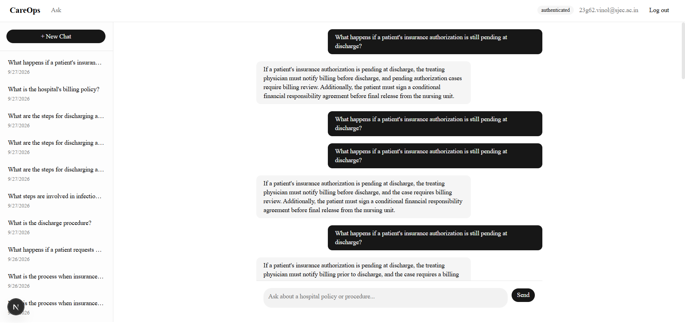
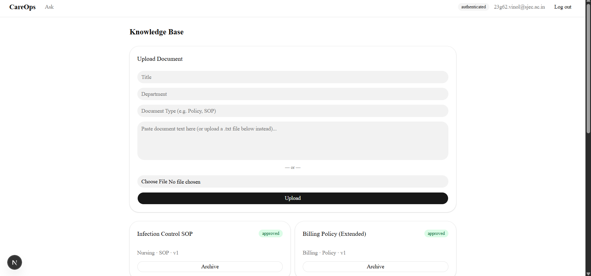
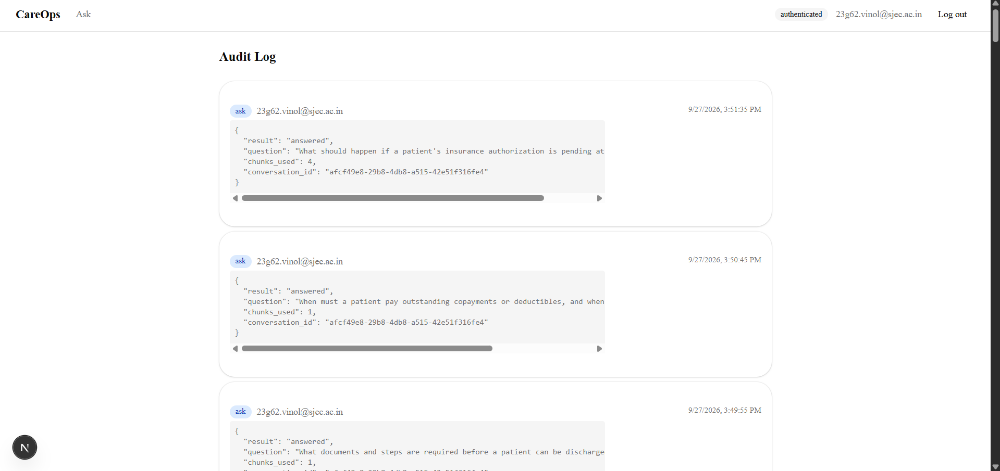

# CareOps — AI-Powered Hospital Knowledge Assistant

A multi-tenant hospital knowledge assistant with an agentic RAG engine that answers staff questions using only that hospital's own approved documents, cites its sources on every answer, and keeps a full audit trail. Built with Next.js, FastAPI, Supabase, and Gemini.

Built for the **RxGPT Agentic AI Healthcare Platform** case study.

**Live app:** _not yet deployed — runs locally, see Setup below_
**API docs:** `http://localhost:8000/docs` (once running locally)
**Repo:** _add your GitHub link here_

---

## Screenshots

| Chat                          | Documents                               | Audit Log                           |
| ----------------------------- | --------------------------------------- | ----------------------------------- |
|  |  |  |

---

## Features

- **Google OAuth Login** — Supabase Auth handles sign-in and session management; a Postgres trigger auto-provisions new users, and an admin assigns their hospital + role afterward
- **Strict Tenant Isolation** — every retrieval query filters by `hospital_id` **and** `status='approved'` inside a single Postgres function (`match_chunks`); `hospital_id` is derived server-side from the verified JWT and is never trusted from the client
- **Grounded RAG Chat** — questions are answered only from that hospital's approved documents via pgvector similarity search + Gemini generation, with every answer citing its source chunks
- **Insufficient-Evidence Guardrail** — if no chunk clears the similarity threshold, the LLM call is skipped entirely and the app honestly says it doesn't have enough information, rather than guessing
- **Conversation History** — questions and answers persist per user, with a sidebar to resume past conversations
- **Document Knowledge Pipeline** — admin upload (paste text or `.txt` file) → chunking → embedding → admin approval, with duplicate-upload idempotency via content hashing
- **Role-Based Access Control** — staff can ask questions only; document upload/approval and the audit log are admin-only, enforced both in the UI (route guarding) and the API (dependency-level checks)
- **Full Audit Trail** — every question asked, document uploaded, processed, and approved/archived is logged with actor, hospital, and event metadata, viewable in an admin-only `/audit` page
- **AI Failure Handling** — malformed or empty LLM responses are caught and treated as insufficient-evidence rather than surfacing a broken answer to the user

---

## Tech Stack

| Layer           | Technology                                                                                     |
| --------------- | ---------------------------------------------------------------------------------------------- |
| Frontend        | Next.js (App Router), React, TypeScript, TailwindCSS, shadcn/ui                                |
| Backend         | FastAPI, Python 3.12, Uvicorn                                                                  |
| Database & Auth | Supabase (PostgreSQL + `pgvector`), Supabase Auth (Google OAuth)                               |
| Vector Search   | pgvector cosine similarity via a Postgres function (`match_chunks`) — no separate vector DB    |
| AI / LLM        | Google Gemini — `gemini-embedding-001` (embeddings, 768 dims), `gemini-3.8-flash` (generation) |
| Testing         | pytest (19 tests) — real DB, mocked Gemini calls                                               |

---

## Architecture

```
Browser
  |
  |── Next.js Frontend
  |     |── Supabase Auth client — Google OAuth login/session
  |     └── /chat, /documents, /audit — role-gated via middleware
  |
  |── FastAPI Backend
  |     |── dependencies.py — JWT verification via Supabase JWKS, hospital_id/role lookup
  |     |── routers/ask.py — retrieval -> guardrail -> Gemini generation -> persistence
  |     |── routers/documents.py — upload -> chunk -> embed -> approve pipeline
  |     |── routers/audit.py — read-only audit trail
  |     └── services/ — embeddings, retrieval, llm, chunking, audit (shared logic)
  |
  └── Supabase (PostgreSQL + pgvector)
        |── hospitals, users, documents, chunks
        |── conversations, messages, retrieval_logs
        └── audit_logs
```

### Request flow for `POST /ask`

1. JWT is verified against Supabase's JWKS endpoint (this project uses asymmetric ES256 signing, not a shared secret).
2. `hospital_id` and `role` are looked up server-side from the `users` table — never taken from the request body.
3. The question is embedded and passed to `match_chunks()`, which does vector similarity search **and** the `hospital_id` + `status='approved'` filter in one query.
4. No strong match → the LLM is skipped and an insufficient-evidence response is returned.
5. Otherwise, Gemini generates a grounded answer as strict JSON (`answer`, `used_chunk_ids`); a malformed or empty response is treated the same as insufficient evidence.
6. The conversation, message, retrieval log, and audit log are all persisted.

---

## Prerequisites

- Node.js v18+
- Python 3.12+
- A Supabase project (URL, anon key, service role key)
- Google OAuth configured as a provider in Supabase Auth
- A Gemini API key ([aistudio.google.com/apikey](https://aistudio.google.com/apikey))

No Docker required — clone → install → run.

---

## Setup & Running

### 1. Clone the repository

```bash
git clone <your-repo-url>
cd careops
```

### 2. Database

Run `supabase/schema.sql` in the Supabase SQL Editor. This creates every table, the `pgvector` extension, the `match_chunks` function, and the auto-provisioning trigger for new logins.

### 3. Backend setup

```bash
cd backend
python -m venv venv
venv\Scripts\activate      # Windows — use `source venv/bin/activate` on Mac/Linux
pip install -r requirements.txt
```

Create `.env` in `backend/`:

```
SUPABASE_URL=https://<project-ref>.supabase.co
DATABASE_URL=postgresql+psycopg2://<your-supabase-connection-string>
GEMINI_API_KEY=<your-key>
```

Run it:

```bash
uvicorn app.main:app --reload --port 8000
```

### 4. Frontend setup

```bash
cd frontend
npm install
```

Create `.env.local` in `frontend/`:

```
NEXT_PUBLIC_SUPABASE_URL=https://<project-ref>.supabase.co
NEXT_PUBLIC_SUPABASE_ANON_KEY=<your-anon-key>
```

Run it:

```bash
npm run dev
```

### 5. Seed sample data

```bash
cd backend
python ../supabase/seed_data.py
```

Populates the 4 sample documents from the case-study brief (2 approved for Hospital A, 1 approved for Hospital B, 1 archived for Hospital A).

### 6. First-login role assignment

Sign-in is Google OAuth only — there's no email/password fallback. Log in once with each account you want to test; this auto-creates a `users` row with `role='pending'`. Then, in Supabase SQL Editor:

```sql
update users set hospital_id = '<hospital-id>', role = 'admin'
  where email = 'your-account@example.com';
```

### 7. Open the app

Go to `http://localhost:3000`.

---

## Usage

- **Login** — sign in with Google via Supabase Auth
- **Ask** — go to `/chat`, ask a question about hospital policy; answers are grounded in your hospital's approved documents only, with sources shown
- **Upload knowledge** (admin only) — go to `/documents`, paste text or upload a `.txt` file, then click **Approve** once it finishes processing
- **Review the audit trail** (admin only) — go to `/audit` to see every question, upload, and approval logged with actor and timestamp

---

## 📂 Project Structure

```
careops/
├── frontend/                       # Next.js App Router Frontend
│   └── src/
│       ├── app/
│       │   ├── login/               # Google OAuth sign-in
│       │   ├── chat/                # Main chat + [conversationId] history
│       │   ├── documents/           # Admin-only knowledge base management
│       │   └── audit/               # Admin-only audit trail
│       ├── components/
│       │   ├── chat/                # MessageBubble, ChatInput, SourceCitation
│       │   ├── documents/           # UploadForm, DocumentCard
│       │   └── layout/              # NavBar (role-conditional)
│       ├── lib/
│       │   ├── supabase/            # Browser + server Supabase clients
│       │   └── apiClient.ts         # Backend fetch wrapper, attaches JWT
│       └── middleware.ts            # Auth + role-based route guarding
│
├── backend/                         # FastAPI Python Service
│   └── app/
│       ├── routers/
│       │   ├── ask.py                # RAG pipeline: retrieve -> guardrail -> generate
│       │   ├── documents.py          # Upload -> chunk -> embed -> approve
│       │   ├── conversations.py      # Conversation history endpoints
│       │   └── audit.py              # Read-only audit trail
│       ├── services/
│       │   ├── embeddings.py         # Gemini embedding calls (query + document)
│       │   ├── retrieval.py          # match_chunks() SQL call, tenant isolation
│       │   ├── llm.py                # Gemini generation, strict JSON parsing
│       │   ├── chunking.py           # Fixed-size text chunking
│       │   └── audit.py              # Shared audit_logs writer
│       ├── dependencies.py           # JWT verification (Supabase JWKS), RBAC
│       └── db/session.py             # SQLAlchemy engine/session
│
├── supabase/
│   ├── schema.sql                    # Full DB schema + match_chunks() function
│   └── seed_data.py                  # Seeds the 4 case-study sample documents
│
├── tests/                            # pytest suite (19 tests)
└── README.md
```

---

## Testing

19 pytest tests, run against the real Supabase DB (in isolated, self-cleaning test hospitals — never touching real seeded data) with all Gemini calls mocked for speed and reliability:

```bash
cd backend
pytest -v
```

Covers tenant isolation (including spoofed `hospital_id` and archived-document exclusion), the insufficient-evidence guardrail, RBAC enforcement, document lifecycle + duplicate-upload idempotency, and audit log correctness.

---

## Scope: What's Real, Simplified, or Not Built

**Fully real, tested:** auth, tenant isolation, RBAC, RAG retrieval + grounded generation + citations, the full document pipeline, audit logging, conversation persistence.

**Intentionally simplified:**

- Text extraction is plain text only (`.txt` / paste) — no PDF parsing
- Document approval is a single admin toggle, not a multi-reviewer workflow
- Chunking is naive fixed-size word chunking, not semantic/section-aware — a single upload containing multiple logical documents (e.g. several policies pasted as one file) will chunk across the boundary between them rather than respecting it
- Similarity threshold (`0.3`) was tuned against short seed sentences; with longer, more realistic documents it can occasionally surface a tangentially related chunk

**Not built (by design):**

- A dedicated tool-calling agent — this build is pure RAG, prioritizing retrieval/isolation correctness and test coverage over a second, less-tested code path
- Production deployment

---

## Production Thinking

_(Written reasoning, not implemented — required by the case-study brief.)_

**Scaling:** `chunks` is indexed on `(hospital_id, status)` with an IVFFlat vector index, so query cost scales with one hospital's document count, not the total across all hospitals. At high chunk volume (hundreds of thousands+), the next step would be tuning IVFFlat's `lists` parameter or moving to pgvector's HNSW index before reaching for a dedicated vector database.

**Deployment:** frontend to Vercel; backend to a container host (Render/Railway/Fly.io) rather than serverless, since FastAPI's DB pooling behaves better with long-lived processes. Supabase would move to a paid tier with pgBouncer connection pooling enabled once concurrent users rise.

**Backup / migration:** the real migration risk isn't data loss (Supabase handles backups on paid tiers) but **embedding model changes** — swapping embedding models means every existing chunk needs re-embedding, since embeddings from different models aren't comparable. Production would store the embedding model/version per chunk to allow incremental, verifiable migration.

**Observability:** currently `print()`-based logging visible only locally. Production needs structured logging, error tracking around Gemini calls specifically (the most volatile external dependency, as this build's development history shows), and a dashboard tracking insufficient-evidence rate as a proxy for knowledge-base coverage gaps.

**Compliance:** per-user rate limiting, an audit log retention policy aligned to the hospital's actual compliance requirements, and a second-approver step before a document reaches `approved` status.

---

## Known Limitations

- Gemini model names/availability changed multiple times during development (both the embedding and generation models used here were mid-deprecation at time of writing) — re-verify model availability before any demo
- Free-tier Gemini rate limits (as low as 5 requests/minute on some models) can cause a generation call to fail under active testing; the app handles this gracefully by falling back to an insufficient-evidence response rather than crashing, but repeated testing in a short window may trigger it
- No PDF/Word support — plain text only
- A single upload containing multiple logical documents will chunk incorrectly across their boundary — always upload one document per file
